<div align="center">

# 🏛️ ATHENAEUM
### *Next-Generation Academic Library Platform*

[](https://lms-ten-dusky.vercel.app/)
[](https://reactrouter.com/)
[](https://supabase.com/)
[](https://www.typescriptlang.org/)
[](https://tailwindcss.com/)
[](#license)

<p align="center">
  <b>Athenaeum</b> is a state-of-the-art library management system crafted with a <i>"quiet luxury"</i> glassmorphic interface, fluid motion physics, multi-branch circulation engines, enterprise security, and real-time analytical dashboards.
</p>

[✨ Live Demo](https://lms-ten-dusky.vercel.app/) · [🛡️ Security Architecture](#-security-architecture) · [🚀 Quick Start](#-getting-started) · [📚 Documentation](#-system-architecture)

</div>

---

## 🌟 Key Highlights

- **🎨 Quiet Luxury Design System** — Deep ink charcoals, warm ivory paper tones, brushed gold accents, frosted glassmorphism (`.glass-strong`), and Framer Motion micro-interactions.
- **🛡️ Hardened Authentication & Zero-Enumeration** — Multi-layered defense against credential harvesting, timing attacks, brute-force attempts, and unauthorized access.
- **⚡ Modern Tech Stack** — React Router v8 (SSR & route modules), Tailwind CSS v4, Zustand state management, and TanStack React Query.
- **📖 Comprehensive Circulation Engine** — Real-time checkout, return, renewal, hold queues, and mobile camera QR/Barcode scanning for instant book check-in (`/circulation?checkin=<barcode>`).
- **💰 Financials & Automated Fine Accrual** — Configurable fine policies, automated daily cron jobs via `pg_cron`, interactive financial charts (Recharts), and fine payment QR code generation.
- **🏢 Multi-Branch & Digital Library** — Inter-branch book transfers, e-book reader support with secure Supabase Storage buckets, and recommendation engines.

---

## 🛡️ Security Architecture

Athenaeum implements an enterprise-grade **defense-in-depth security model** protecting all API boundaries, route modules, and database operations:

```
┌─────────────────────────────────────────────────────────────────────────┐
│                          INCOMING HTTP REQUEST                          │
└────────────────────────────────────┬────────────────────────────────────┘
                                     │
                                     ▼
       ┌──────────────────────────────────────────────────────────┐
       │ 1. Sliding-Window Rate Limiting & Lockout Engine         │
       │    (IP + Target sliding window, auto stale cleanup)       │
       └─────────────────────────────┬────────────────────────────┘
                                     │
                                     ▼
       ┌──────────────────────────────────────────────────────────┐
       │ 2. Equalized Execution Timing & Constant-Time Responses  │
       │    (400ms execution target; eliminates side-channel leaks)│
       └─────────────────────────────┬────────────────────────────┘
                                     │
                                     ▼
       ┌──────────────────────────────────────────────────────────┐
       │ 3. Schema Boundary Validation & Input Sanitization       │
       │    (Strict Zod schema enforcement across all payloads)   │
       └─────────────────────────────┬────────────────────────────┘
                                     │
                                     ▼
       ┌──────────────────────────────────────────────────────────┐
       │ 4. Server Route Guards & Hierarchical RBAC                │
       │    (Role validation: Student(1) < Faculty(2) < Lib(3) < Admin(4)) │
       └─────────────────────────────┬────────────────────────────┘
                                     │
                                     ▼
       ┌──────────────────────────────────────────────────────────┐
       │ 5. Supabase Row Level Security (RLS) & Definer SQL       │
       │    (Database-level policy isolation & SECURITY DEFINER)  │
       └──────────────────────────────────────────────────────────┘
```

### Security Capabilities & Protections

- **⚡ Sliding-Window Rate Limiting:** Applied across critical authentication routes (`/login`, `/signup`, `/forgot-password`, `/reset-password`). Uses IP and target-keyed sliding windows with automatic lockout windows (up to 30 min) and memory cleanup.
- **🛡️ Anti-User Enumeration:** All auth endpoints return generic, uniform responses (*"If an account exists..."* / *"Invalid email or password"*) regardless of account existence.
- **⏱️ Timing Attack Protection (`equalizeTiming`):** Auth actions enforce constant-time execution targets (minimum 400ms) to neutralize timing side-channel attacks for email harvesting.
- **🔑 Cryptographic Password Reset Tokens:** Reset tokens generate 256-bit entropy (`crypto.randomBytes(32)`), are stored exclusively as **SHA-256 digests**, expire in **1 hour**, enforce single-use consumption (`used = true`), and utilize constant-time comparison (`crypto.timingSafeEqual`).
- **📋 Schema-Based Input Validation:** Every incoming payload is validated against strict Zod schemas (`loginSchema`, `signupSchema`, `forgotPasswordSchema`, `resetPasswordSchema`) before execution.
- **🔒 Database Row Level Security (RLS):** All database tables strictly enforce Supabase RLS. Sensitive email-to-ID lookups use `SECURITY DEFINER` SQL functions with restricted `search_path = public` to prevent SQL injection or permission escalation.

---

## 👥 Role-Based Access Control (RBAC)

Athenaeum enforces hierarchical permissions across 4 distinct user tiers:

| Role | Hierarchy | Capabilities |
| :--- | :---: | :--- |
| **Student** | Tier 1 | Browse catalog, reserve books, hold items, view borrowing history & personal fines. |
| **Faculty** | Tier 2 | Extended 28-day loan limits, higher borrowing caps (10 items), digital resource access. |
| **Librarian** | Tier 3 | Circulation console: issue/return loans, manage hold queues, camera barcode scanner. |
| **Admin** | Tier 4 | Full system oversight: role management, branch creation, fine policies & financial analytics. |

---

## 🗺️ System Architecture & Dependency Graph

```mermaid
flowchart TD
    subgraph Client ["Client Layer - Browser"]
        UI["Glassmorphic UI - Tailwind v4 + Framer Motion"]
        Forms["React Hook Form + Zod Resolvers"]
    end

    subgraph Router ["Application & Route Layer - React Router v8"]
        LandingRoute["/ - Landing Page"]
        
        subgraph AuthRoutes ["Security Guarded Auth Routes"]
            LoginRoute["/login - Rate-Limited, Anti-Enum"]
            SignupRoute["/signup - Rate-Limited, Strict Validation"]
            ForgotRoute["/forgot-password - 256-bit SHA-256 Token Gen"]
            ResetRoute["/reset-password - Single-Use Token Verification"]
        end

        subgraph DashboardRoutes ["Protected Dashboard Routes - requireAuth"]
            DashIndex["/dashboard - Personal Portal"]
            CatalogRoute["/catalog - Search & Hold Queue"]
            WishlistRoute["/wishlist - Saved Books"]
            ProfileRoute["/profile - User Account"]
            
            subgraph LibrarianRoutes ["Librarian Tier - requireRole librarian"]
                ManageRoute["/manage - Catalog & Inventory"]
                CirculationRoute["/circulation - Barcode QR Scanner"]
                OverdueRoute["/overdue - Fine Accrual Management"]
            end
            
            subgraph AdminRoutes ["Admin Tier - requireRole admin"]
                AdminRoute["/admin - System Analytics & Financials"]
            end
        end
    end

    subgraph Security ["Security & Middleware Engine"]
        RateLimiter["Sliding-Window Rate Limiter"]
        TimingEqualizer["Equalized Execution Timing"]
        TokenHasher["Cryptographic SHA-256 Token Engine"]
        ZodValidation["Zod Schema Validation Engine"]
        RBACGuard["Hierarchical RBAC Evaluator"]
    end

    subgraph Database ["Database & Backend Layer - Supabase"]
        AuthService["Supabase Auth Service"]
        DB["PostgreSQL Database - RLS Enabled"]
        TokensTable["password_reset_tokens - SHA-256 Hashes"]
        SecDefiner["SECURITY DEFINER Functions"]
    end

    Forms --> ZodValidation
    LoginRoute --> RateLimiter
    LoginRoute --> TimingEqualizer
    SignupRoute --> RateLimiter
    ForgotRoute --> RateLimiter
    ForgotRoute --> TimingEqualizer
    ResetRoute --> RateLimiter
    
    DashIndex --> RBACGuard
    CatalogRoute --> RBACGuard
    ManageRoute --> RBACGuard
    CirculationRoute --> RBACGuard
    AdminRoute --> RBACGuard

    ForgotRoute --> TokenHasher
    ResetRoute --> TokenHasher
    TokenHasher --> TokensTable

    RBACGuard --> AuthService
    AuthService --> DB
    SecDefiner --> DB

    style Client fill:#0f172a,stroke:#334155,color:#e2e8f0
    style Security fill:#1e3a5f,stroke:#60a5fa,color:#e0f2fe
    style AuthRoutes fill:#451a03,stroke:#f59e0b,color:#fef3c7
    style DashboardRoutes fill:#064e3b,stroke:#10b981,color:#d1fae5
    style Database fill:#3b0764,stroke:#a855f7,color:#f3e8ff
```



### Module Structure

```
app/
├── root.tsx                  # HTML shell, fonts, theme & provider injection
├── routes.ts                 # React Router v8 configuration
├── app.css                   # Tailwind v4 design tokens (ink/gold/paper, glass)
├── routes/
│   ├── _auth.tsx             # Auth layout (split-screen with Hyperspeed canvas)
│   ├── _auth.login.tsx       # Rate-limited login with generic anti-enumeration
│   ├── _auth.signup.tsx      # Registration with email verification enforcement
│   ├── _auth.forgot-password.tsx # Secure SHA-256 reset token generator
│   ├── _auth.reset-password.tsx  # Single-use reset token validator
│   ├── _dashboard.tsx        # Protected application shell
│   ├── _dashboard._index.tsx # Personalized user portal
│   ├── _dashboard.catalog.tsx# Interactive catalog (filters, search, holds)
│   ├── _dashboard.circulation.tsx # Circulation console & barcode camera scanner
│   ├── _dashboard.admin.tsx  # Admin portal (user management & financial charts)
│   └── _dashboard.profile.tsx# User profile & borrowing settings
├── lib/
│   ├── auth.ts               # Route guards (requireAuth, requireRole)
│   ├── auth-security.ts      # Rate limiter, token hasher & timing equalizers
│   ├── validation.ts         # Zod schemas for request validation
│   └── supabase/             # Server/client clients, cookies & RLS types
└── components/
    ├── ui/                   # Glass cards, buttons, text fields, badges
    ├── layout/               # Navigation sidebar, topbar, page headers
    └── motion/               # Framer Motion animation presets
```

---

## 🚀 Getting Started

### 1. Prerequisites
- **Node.js**: `v20.0.0` or higher
- **npm**: `v10.0.0` or higher
- **Supabase Account**: A free or paid Supabase project

### 2. Installation & Configuration

Clone the repository and install dependencies:

```bash
git clone https://github.com/Satyasisir-06/LMS.git
cd LMS
npm install
```

Copy `.env.example` to `.env` and populate your credentials:

```env
SUPABASE_URL=https://your-project.supabase.co
SUPABASE_ANON_KEY=your-anon-public-key
SUPABASE_SERVICE_ROLE_KEY=your-service-role-secret-key
```

### 3. Database Setup

Run the schema and migration scripts in your **Supabase SQL Editor**:

1. Execute `supabase/schema.sql` (Creates RBAC, profiles, triggers & RLS policies).
2. Execute `supabase/migrations/20260726000000_password_resets.sql` (Password reset table & functions).

### 4. Run Development Server

```bash
npm run dev
```

Open [http://localhost:5173](http://localhost:5173) in your browser.

---

## 💻 Available Scripts

| Script | Command | Purpose |
| :--- | :--- | :--- |
| **Development** | `npm run dev` | Starts Vite dev server with Hot Module Replacement (HMR) |
| **Build** | `npm run build` | Compiles production client assets and server bundle |
| **Start** | `npm run start` | Launches production server via `@react-router/serve` |
| **Type Check** | `npm run typecheck` | Validates TypeScript types and route module declarations |

---

## 🌐 Deployment

The application is optimized for deployment on **Vercel** or any Node.js / Docker container host.

- **Live URL:** [https://lms-ten-dusky.vercel.app/](https://lms-ten-dusky.vercel.app/)

### Supabase Production URL Configuration
Set the following under **Authentication ➔ URL Configuration** in your Supabase Dashboard:

- **Site URL:** `https://lms-ten-dusky.vercel.app`
- **Redirect URLs:**
  ```text
  https://lms-ten-dusky.vercel.app/reset-password
  https://lms-ten-dusky.vercel.app/login
  https://lms-ten-dusky.vercel.app/**
  ```

---

## 📄 License

This project is licensed under the **MIT License** — see the [LICENSE](LICENSE) file for details.

---

<div align="center">
  <sub>Crafted with precision for modern academic libraries. Designed & Engineered by <a href="https://github.com/Satyasisir-06">Satyasisir</a>.</sub>
</div>
